# Mission Contract System

A comprehensive smart contract system for managing missions, applications, interactions, rewards (INX points and USDC), decentralized identity (DID), reputation tracking, miner incentives, and settlement on Base blockchain.

## 🎯 What This System Does

This is a **mission-based reward system with identity and reputation tracking** where:

1. **Admins create missions** (campaigns) with specific goals
2. **Apps are added** to missions with interaction requirements
3. **Users complete interactions** (like using apps, completing tasks)
4. **Rewards are distributed** in INX points or USDC tokens to participants
5. **Identity and reputation** are tracked on-chain via DID (Decentralized Identity)
6. **Miners onboard** new people in different geographies and earn rewards
7. **Everything is tracked** on-chain for transparency

## 🏗️ Architecture

### Core Contracts

- **MissionFactory**: Deploys individual mission contracts using upgradeable proxies
- **Mission**: Individual mission contracts with applications, interactions, and rewards
- **MissionManager**: Central hub for managing missions and their lifecycle

### Identity & Reputation System

- **IdentityLayer**: Manages decentralized identities (DID), credentials, and reputation metrics
  - Tracks reputation scores, transaction counts, volume, onboarding activities
  - Manages verifiable credentials
  - Calculates reputation based on multiple factors

### Reward Management

- **INXRewardManager**: Manages INX token rewards distribution
  - Handles reward pools, staking, and reward claims
  - Supports both INX points and USDC rewards
- **StablecoinSettlement**: Settlement layer for USDC transactions
  - Batch settlements for multiple recipients
  - Escrow functionality with dispute resolution

### Miner Incentive System

- **MinerIncentive**: Manages incentives for miners who onboard new people
  - Tracks onboarding by geography
  - Manages incentive pools
  - Integrates with reward manager and settlement contracts

### Interfaces

- **IUSDC**: Interface for USDC token interactions
- **IMission**: Interface for Mission contracts
- **IIdentityLayer**: Interface for IdentityLayer
- **IMinerIncentive**: Interface for MinerIncentive
- **IINXRewardManager**: Interface for INXRewardManager
- **IStablecoinSettlement**: Interface for StablecoinSettlement

### 📊 Contract Relationships

```mermaid
graph TB
    Admin[👤 Admin/Owner] --> MissionManager[MissionManager<br/>🎯 Central Hub]
    User[👤 User/Participant] --> Mission[Mission Contract<br/>📋 Individual Mission]
    Miner[👤 Miner] --> MinerIncentive[MinerIncentive<br/>⛏️ Miner Rewards]
    
    MissionManager --> MissionFactory[MissionFactory<br/>🏭 Factory]
    MissionFactory --> Mission
    
    Mission --> INXRewardManager[INXRewardManager<br/>🎁 Reward Manager]
    Mission --> StablecoinSettlement[StablecoinSettlement<br/>💸 Settlement]
    Mission --> IdentityLayer[IdentityLayer<br/>🆔 DID & Reputation]
    
    MinerIncentive --> INXRewardManager
    MinerIncentive --> StablecoinSettlement
    MinerIncentive --> IdentityLayer
    
    Mission -.->|USDC Rewards| USDC[USDC Token<br/>💰 ERC20]
    StablecoinSettlement -.->|Settles| USDC
    INXRewardManager -.->|Manages| USDC
    
    IdentityLayer -.->|Tracks Reputation| User
    IdentityLayer -.->|Tracks Reputation| Miner
    
    classDef core fill:#e1f5fe,stroke:#01579b,stroke-width:2px
    classDef reward fill:#e8f5e8,stroke:#2e7d32,stroke-width:2px
    classDef identity fill:#f3e5f5,stroke:#4a148c,stroke-width:2px
    classDef user fill:#fff3e0,stroke:#e65100,stroke-width:2px
    classDef token fill:#ffebee,stroke:#c62828,stroke-width:2px
    
    class MissionManager,MissionFactory,Mission core
    class INXRewardManager,StablecoinSettlement,MinerIncentive reward
    class IdentityLayer identity
    class Admin,User,Miner user
    class USDC token
```



## 🔧 Core Contracts Explained

### 1. MissionFactory Contract

**Purpose**: A factory that creates individual Mission contracts using upgradeable proxies (ERC1967).

**Key Features**:
- Creates new mission contracts using proxy pattern
- Tracks all deployed missions
- Manages mission ownership
- Supports batch mission creation
- Emergency recovery functions

**Data Structures**:
- `missions`: Maps mission ID to mission address
- `isMission`: Maps address to boolean (is valid mission)
- `missionList`: Array of all mission addresses

### 2. Mission Contract

**Purpose**: Individual mission with applications, interactions, and reward distribution. Supports both INX points and USDC rewards.

**Key Features**:
- Add applications (dApps, services)
- Create interactions (tasks, actions)
- Merkle tree-based participant verification
- Deposit and distribute rewards (INX points or USDC)
- Batch reward distribution
- Allow participants to claim rewards
- Upgradeable via UUPS pattern
- Automatic reputation tracking via IdentityLayer

**Reward Types**:
- **INX_POINTS**: Rewards distributed via INXRewardManager
- **USDC**: Rewards distributed via StablecoinSettlement

**Data Structures**:
- `Application`: App metadata (name, description, URLs, images)
- `Interaction`: Task metadata (title, description, reward amount)
- `participantsMerkleRoot`: Merkle root for participant verification

### 3. MissionManager Contract

**Purpose**: Central hub for managing the entire mission system.

**Key Features**:
- Creates and registers missions
- Adds applications and interactions to missions
- Updates participant Merkle roots
- Manages reward distribution
- Configures reward contracts and types
- Tracks mission statistics
- Emergency recovery functions

### 4. IdentityLayer Contract

**Purpose**: Decentralized Identity (DID) management and reputation tracking.

**Key Features**:
- Register and manage DIDs (Decentralized Identifiers)
- Issue and verify credentials
- Track comprehensive reputation metrics:
  - Reputation score (0-10000)
  - Transaction count and success rate
  - Total volume
  - Onboarding count
  - Contributions count
  - Rewards earned
  - Activity streak
  - Account age
- Authorization system for contract updates
- Automatic reputation calculation

**Reputation Calculation**:
- Transaction count (10% weight)
- Volume (20% weight)
- Success rate (30% weight)
- Activity (15% weight)
- Onboarding (15% weight)
- Streak (10% weight)

### 5. INXRewardManager Contract

**Purpose**: Manages INX token rewards distribution and staking.

**Key Features**:
- Create and manage reward pools
- Stake INX tokens to earn rewards
- Distribute rewards to multiple recipients
- Calculate and claim pending rewards
- Track staking history
- Support for both INX points and USDC

**Data Structures**:
- `RewardPool`: Pool configuration (name, total rewards, time range, rate)
- `Stake`: Staker information (amount, staked at, rewards claimed)

### 6. StablecoinSettlement Contract

**Purpose**: Settlement layer for stablecoin (USDC) transactions.

**Key Features**:
- Batch settlements for multiple recipients
- Escrow functionality with optional arbiters
- Dispute resolution mechanism
- Settlement fee management
- Track all settlements and escrows

**Data Structures**:
- `Settlement`: Batch settlement information
- `Escrow`: Escrow account with payer, payee, and arbiter

### 7. MinerIncentive Contract

**Purpose**: Manages incentives for miners who onboard new people in different geographies.

**Key Features**:
- Register and manage miners
- Record onboarding contributions by geography
- Create incentive pools
- Distribute rewards (INX points or USDC)
- Track geography-based statistics
- Automatic reputation updates via IdentityLayer

**Data Structures**:
- `Miner`: Miner information (address, contributions, people onboarded, geographies)
- `Contribution`: Onboarding contribution (miner, amount, people onboarded, geography)
- `IncentivePool`: Pool configuration for miner rewards

## 🔄 End-to-End Flow

### 🌐 Mission Completion Flow

1. **Admin creates mission** via MissionManager
2. **Admin adds applications** to the mission
3. **Admin adds interactions** with reward amounts
4. **Admin deposits rewards** (USDC or configures INX pool)
5. **Users complete interactions** (tracked off-chain)
6. **Admin updates Merkle root** with participants
7. **Admin distributes rewards** (batch or individual claims)
8. **Participants claim rewards** using Merkle proof
9. **IdentityLayer updates** reputation automatically

### ⛏️ Miner Onboarding Flow

1. **Admin registers miner** in MinerIncentive
2. **Miner onboards people** in different geographies
3. **Admin records contributions** with geography and people count
4. **Admin verifies contributions**
5. **Admin distributes rewards** (INX points or USDC)
6. **IdentityLayer updates** miner reputation automatically

### 🆔 Identity & Reputation Flow

1. **User registers DID** in IdentityLayer
2. **User links address** to DID
3. **User completes actions** (missions, onboarding, etc.)
4. **Contracts update reputation** automatically:
   - Transaction count increases
   - Volume accumulates
   - Success rate calculated
   - Activity streak tracked
5. **Reputation score** recalculated based on all factors
6. **Credentials issued** by authorized issuers

## 💰 Reward System

### Reward Types

The system supports two reward types:

1. **INX Points** (via INXRewardManager)
   - Distributed through reward pools
   - Can be staked for additional rewards
   - Tracked in IdentityLayer

2. **USDC** (via StablecoinSettlement)
   - Batch settlements for efficiency
   - Individual claims with Merkle proof
   - Tracked in IdentityLayer

### Reward Distribution

**For Missions**:
```solidity
// Set reward type
mission.setRewardType(RewardType.INX_POINTS, rewardPoolId);
// or
mission.setRewardType(RewardType.USDC, 0);

// Batch distribute
mission.batchDistributeRewards(recipients, amounts);

// Individual claim
mission.claimReward(missionExecutionId, rewardAmount, proof);
```

**For Miners**:
```solidity
// Distribute rewards
minerIncentive.distributeRewards(
    poolId,
    minerAddresses,
    rewardAmounts,
    RewardType.USDC,  // or RewardType.INX_POINTS
    rewardPoolId
);
```

## 🆔 Identity & Reputation System

### Registering Identity

```solidity
// Register a new DID
identityLayer.registerIdentity(did, metadataUri);

// Link address to DID
identityLayer.linkAddressToDid(did);
```

### Reputation Metrics

The system tracks:
- **Reputation Score**: 0-10000 (calculated automatically)
- **Transaction Count**: Total number of transactions
- **Total Volume**: Cumulative transaction volume
- **Success Rate**: Percentage of successful transactions
- **Onboarding Count**: Number of people onboarded (for miners)
- **Contributions Count**: Number of contributions made
- **Rewards Earned**: Total rewards earned
- **Activity Streak**: Consecutive days of activity
- **Account Age**: Time since identity creation

### Viewing Reputation

```solidity
// Get reputation by DID
ReputationMetrics memory metrics = identityLayer.getReputationMetrics(did);

// Get reputation by address
ReputationMetrics memory metrics = identityLayer.getReputationMetricsByAddress(address);
```

## 📋 Complete Workflow Example

### Mission Example: "DeFi Summer Campaign"

1. **Setup Phase**:
   - Admin creates mission via MissionManager
   - Admin adds Uniswap application
   - Admin adds interaction: "Swap $50" → 5 USDC reward
   - Admin adds Aave application
   - Admin adds interaction: "Supply $100" → 3 USDC reward
   - Admin sets reward type (USDC or INX points)
   - Admin deposits rewards

2. **Participation Phase**:
   - User completes Uniswap swap
   - User completes Aave supply
   - Admin verifies completions
   - Admin updates Merkle root with participants

3. **Distribution Phase**:
   - Admin distributes rewards (batch or individual)
   - Rewards settled via StablecoinSettlement (USDC) or INXRewardManager (INX)
   - IdentityLayer updates user reputation

4. **Claim Phase**:
   - User claims reward with Merkle proof
   - Reward transferred to user wallet
   - IdentityLayer records transaction

### Miner Example: "Global Onboarding Campaign"

1. **Setup Phase**:
   - Admin registers miners
   - Admin creates incentive pool
   - Admin funds pool with rewards

2. **Onboarding Phase**:
   - Miner onboards 10 people in "US" geography
   - Miner onboards 15 people in "EU" geography
   - Admin records contributions
   - Admin verifies contributions

3. **Reward Phase**:
   - Admin distributes rewards based on contributions
   - Rewards settled via appropriate contract
   - IdentityLayer updates miner reputation

## 🔧 Function Reference

### MissionManager Functions

| Function | Purpose | Access |
|----------|---------|--------|
| `createMission(name, desc)` | Create and register mission | Owner only |
| `addApplicationToMission(...)` | Add app to specific mission | Owner only |
| `addInteractionToMission(...)` | Add task to mission app | Owner only |
| `updateMissionParticipantsMerkleRoot(...)` | Update participant Merkle root | Owner only |
| `depositRewardsToMission(...)` | Fund mission with rewards | Owner only |
| `distributeRewardsForMission(...)` | Distribute mission rewards | Owner only |
| `batchDistributeRewardsForMission(...)` | Batch distribute rewards | Owner only |
| `setMissionRewardContracts(...)` | Configure reward contracts | Owner only |
| `setMissionRewardType(...)` | Set reward type (INX/USDC) | Owner only |
| `claimRewardFromMission(...)` | Claim rewards from mission | Public |

### Mission Contract Functions

| Function | Purpose | Access |
|----------|---------|--------|
| `addApplication(...)` | Add new app to mission | Owner only |
| `addInteraction(...)` | Add task to application | Owner only |
| `updateParticipantsMerkleRoot(...)` | Update participant Merkle root | Owner only |
| `depositRewards(amount)` | Deposit USDC rewards | Owner only |
| `distributeRewards()` | Mark rewards as distributed | Owner only |
| `batchDistributeRewards(...)` | Batch distribute rewards | Owner only |
| `claimReward(...)` | Claim personal rewards | Participant only |
| `setRewardContracts(...)` | Configure reward contracts | Owner only |
| `setRewardType(...)` | Set reward type | Owner only |

### IdentityLayer Functions

| Function | Purpose | Access |
|----------|---------|--------|
| `registerIdentity(did, metadataUri)` | Register new DID | Public |
| `linkAddressToDid(did)` | Link address to DID | Public |
| `issueCredential(...)` | Issue credential to DID | Credential issuer |
| `verifyCredential(credentialId)` | Verify credential validity | Public view |
| `getReputationMetrics(did)` | Get reputation by DID | Public view |
| `getReputationMetricsByAddress(address)` | Get reputation by address | Public view |
| `recordTransaction(...)` | Record transaction (authorized) | Authorized only |
| `updateOnboardingCount(...)` | Update onboarding count | Authorized only |
| `updateContributionsCount(...)` | Update contributions count | Authorized only |
| `updateRewardsEarned(...)` | Update rewards earned | Authorized only |

### MinerIncentive Functions

| Function | Purpose | Access |
|----------|---------|--------|
| `registerMiner(minerAddress)` | Register new miner | Owner only |
| `recordContribution(...)` | Record onboarding contribution | Owner only |
| `verifyContribution(contributionId)` | Verify contribution | Owner only |
| `createIncentivePool(...)` | Create incentive pool | Owner only |
| `distributeRewards(...)` | Distribute rewards to miners | Owner only |
| `getGeographyStats(geography)` | Get geography statistics | Public view |

### INXRewardManager Functions

| Function | Purpose | Access |
|----------|---------|--------|
| `createRewardPool(...)` | Create reward pool | Owner only |
| `fundPool(poolId, amount)` | Fund pool with USDC | Owner only |
| `stake(amount)` | Stake INX tokens | Public |
| `unstake(amount)` | Unstake INX tokens | Public |
| `distributeRewards(...)` | Distribute rewards | Owner only |
| `claimRewards(poolId, amount)` | Claim rewards | Public |
| `calculatePendingRewards(...)` | Calculate pending rewards | Public view |

### StablecoinSettlement Functions

| Function | Purpose | Access |
|----------|---------|--------|
| `createSettlement(...)` | Create batch settlement | Public |
| `executeSettlement(settlementId)` | Execute settlement | Initiator only |
| `createEscrow(...)` | Create escrow account | Public |
| `releaseEscrow(escrowId)` | Release escrow to payee | Payer/Arbiter |
| `refundEscrow(escrowId)` | Refund escrow to payer | Payee/Arbiter |
| `resolveDispute(...)` | Resolve disputed escrow | Arbiter only |

## 🚀 Quick Start

### Prerequisites

- [Foundry](https://book.getfoundry.sh/getting-started/installation)
- [Node.js](https://nodejs.org/) (for deployed contract testing)
- Base Sepolia or Base Mainnet RPC access

### Installation

1. Clone the repository
2. Install dependencies:
   ```bash
   forge install
   ```

3. Copy environment variables:
   ```bash
   cp env.example .env
   ```

4. Fill in your `.env` file with:
   - `PRIVATE_KEY`: Your private key (without 0x prefix)
   - `USDC_ADDRESS`: USDC contract address for the network
   - `ETHERSCAN_API_KEY`: For contract verification

### USDC Addresses

- **Base Sepolia**: `0x036CbD53842c5426634e7929541eC2318f3dCF7e`
- **Base Mainnet**: `0x833589fCD6eDb6E08f4c7C32D4f71b54bdA02913`

## 🧪 Testing

### Running Tests

```bash
# Run all tests
make test

# Run tests with verbose output
make test-verbose

# Run specific test file
forge test --match-contract MissionFactoryTest

# Run specific test function
forge test --match-test testCreateMission
```

## 🚀 Deployment

### Deployment Commands

```bash
# Deploy to Base Sepolia
make deploy-sepolia

# Deploy to Base Mainnet
make deploy-mainnet

# Verify contracts
make verify-sepolia

# Test deployed contracts
make test-deployed-sepolia
```

### Deployment Order

1. Deploy IdentityLayer
2. Deploy INXRewardManager
3. Deploy StablecoinSettlement
4. Deploy MinerIncentive (with references to above)
5. Deploy MissionFactory
6. Deploy MissionManager
7. Authorize contracts in IdentityLayer
8. Configure reward contracts in Mission and MinerIncentive

## 🔒 Security Features

- **Ownable**: Only contract owners can perform administrative functions
- **ReentrancyGuard**: Prevents reentrancy attacks
- **Input Validation**: Comprehensive parameter validation
- **Access Control**: Role-based access control
- **Authorization System**: Contracts must be authorized to update reputation
- **Upgradeable Contracts**: Mission contracts use UUPS upgradeable pattern
- **Emergency Functions**: Recovery functions for stuck funds

## 📊 System Architecture Diagram


## 📝 License

MIT License - see LICENSE file for details

## 🤝 Contributing

1. Fork the repository
2. Create a feature branch
3. Make your changes
4. Add tests
5. Submit a pull request

## 📞 Support

For questions or support, please open an issue on GitHub.
