# Mission Contract System

A comprehensive smart contract system for managing missions, applications, interactions, and USDC rewards on Base blockchain.

## 🎯 What This System Does

This is a **mission-based reward system** where:

1. **Admins create missions** (campaigns) with specific goals
2. **Apps are added** to missions with interaction requirements
3. **Users complete interactions** (like using apps, completing tasks)
4. **Rewards are distributed** in USDC tokens to participants
5. **Everything is tracked** on-chain for transparency

## 🏗️ Architecture

- **MissionFactory**: Deploys individual mission contracts
- **Mission**: Individual mission contracts with applications, interactions, and rewards
- **MissionManager**: Central hub for managing missions and their lifecycle
- **Interfaces**: IUSDC and IMission for type safety

### 📊 Contract Relationships


## 🔧 Core Contracts Explained

### 1. MissionFactory Contract

**Purpose**: A factory that creates individual Mission contracts.

**Key Features**:
- Creates new mission contracts
- Tracks all deployed missions
- Manages mission ownership
- Emergency recovery functions

**Data Structures**:
- `missions`: Maps mission ID to mission address
- `isMission`: Maps address to boolean (is valid mission)
- `missionList`: Array of all mission addresses

### 2. Mission Contract

**Purpose**: Individual mission with applications, interactions, and reward distribution.

**Key Features**:
- Add applications (dApps, services)
- Create interactions (tasks, actions)
- Add participants who completed interactions
- Deposit and distribute USDC rewards
- Allow participants to claim rewards

**Data Structures**:
- `Application`: App metadata (name, description, URLs, images)
- `Interaction`: Task metadata (title, description, reward amount)
- `Participant`: User data (completed interactions, rewards, claim status)

### 3. MissionManager Contract

**Purpose**: Central hub for managing the entire mission system.

**Key Features**:
- Creates and registers missions
- Adds applications and interactions to missions
- Manages participants across missions
- Tracks mission statistics
- Emergency recovery functions

## 🔄 End-to-End Flow

### 🌐 Web2 Integration

The smart contracts work with a Web2 frontend that:

1. **Frontend calls smart contract functions** via web3 libraries (ethers.js, web3.js)
2. **Displays mission data** (applications, interactions, rewards)
3. **Handles user interactions** (completing tasks, claiming rewards)
4. **Manages admin operations** (creating missions, adding participants)

### 📱 How Apps Are Added

```solidity
// MissionManager adds applications to missions
addApplicationToMission(
    missionId,           // Which mission
    "My DeFi App",       // App name
    "A DeFi protocol",   // Description
    "https://app.com",   // App URL
    "banner.jpg",        // Banner image
    "logo.png"          // App logo
)
```

### 🎯 How Interactions Are Added

```solidity
// MissionManager adds interactions to applications
addInteractionToMission(
    missionId,           // Which mission
    applicationId,       // Which app
    "Swap Tokens",       // Task title
    "Swap at least $10", // Task description
    "Start Swap",        // Button text
    "https://app.com/swap", // Action URL
    1000000             // Reward (1 USDC)
)
```

### 👥 How Participants Are Added

```solidity
// Admin adds participants who completed interactions
addParticipantToMission(
    missionId,                    // Which mission
    userAddress,                  // User's wallet
    [interactionId1, interactionId2] // Completed tasks
)
```

### 💰 How Rewards Are Added

```solidity
// Admin deposits USDC rewards
depositRewardsToMission(
    missionId,    // Which mission
    1000000000   // 1000 USDC (6 decimals)
)
```

### 🎁 How Rewards Are Distributed

```solidity
// Admin distributes rewards equally
distributeRewardsForMission(missionId)
```

```solidity
// Participants claim their rewards
claimRewardFromMission(missionId)
```

## 📋 Complete Workflow Example

### 1. Setup Phase (Admin Only)


### 2. Participation Phase (Users & Admin)


### 3. Claim Phase (Participants)


### 4. Real-World Example

**Mission**: "DeFi Summer Campaign"

1. **Create Mission**: "Earn rewards by exploring DeFi protocols"
2. **Add App**: Uniswap - "Leading DEX on Base"
3. **Add Interaction**: "Swap $50 worth of tokens" → 5 USDC reward
4. **Add App**: Aave - "Lending protocol"
5. **Add Interaction**: "Supply $100 to lending pool" → 3 USDC reward

**User Journey**:
1. User sees mission on frontend
2. User completes Uniswap swap
3. Admin verifies and adds user as participant
4. User completes Aave supply
5. Admin adds user to both interactions
6. Admin distributes total rewards (8 USDC)
7. User claims 8 USDC to their wallet

## 🔧 Function Deep Dive

### MissionFactory Functions

| Function | Purpose | Access |
|----------|---------|--------|
| `createMission()` | Creates new mission contract | Owner only |
| `createMultipleMissions(count)` | Creates multiple missions | Owner only |
| `transferMissionOwnership(missionId, newOwner)` | Changes mission owner | Owner only |
| `getMission(missionId)` | Get mission address | Public |
| `getAllMissions()` | Get all mission addresses | Public |
| `getMissionCount()` | Get total missions | Public |

### Mission Contract Functions

| Function | Purpose | Access |
|----------|---------|--------|
| `addApplication(...)` | Add new app to mission | Owner only |
| `addInteraction(...)` | Add task to application | Owner only |
| `addParticipant(user, interactionIds)` | Add user who completed tasks | Owner only |
| `depositRewards(amount)` | Deposit USDC rewards | Owner only |
| `distributeRewards()` | Distribute rewards equally | Owner only |
| `claimReward()` | Claim personal rewards | Participant only |
| `deactivateApplication(id)` | Deactivate app | Owner only |
| `deactivateInteraction(id)` | Deactivate task | Owner only |

### MissionManager Functions

| Function | Purpose | Access |
|----------|---------|--------|
| `createMission(name, desc)` | Create and register mission | Owner only |
| `addApplicationToMission(...)` | Add app to specific mission | Owner only |
| `addInteractionToMission(...)` | Add task to mission app | Owner only |
| `addParticipantToMission(...)` | Add participant to mission | Owner only |
| `depositRewardsToMission(...)` | Fund mission with rewards | Owner only |
| `distributeRewardsForMission(...)` | Distribute mission rewards | Owner only |
| `claimRewardFromMission(...)` | Claim rewards from mission | Public |
| `deactivateMission(id)` | Deactivate mission | Owner only |

## 📚 Solidity for Beginners

### 🤓 What is Solidity?

Solidity is the programming language for writing smart contracts on Ethereum and EVM-compatible blockchains like Base.

**Key Concepts**:
- **Contracts**: Like classes in other languages, but they run on the blockchain
- **Functions**: Contract methods you can call
- **State Variables**: Data stored permanently on the blockchain
- **Events**: Logs that can be read by frontend applications
- **Modifiers**: Special functions that change how other functions behave

### 🏗️ Understanding This Contract Structure

#### 1. **Contract Declaration**
```solidity
contract MissionFactory is Ownable, ReentrancyGuard {
    // Contract code here
}
```

- `MissionFactory` is the contract name
- `is Ownable, ReentrancyGuard` means it inherits security features
- `Ownable`: Only the owner can call certain functions
- `ReentrancyGuard`: Prevents reentrancy attacks (hacking technique)

#### 2. **State Variables**
```solidity
address public immutable usdcToken;
uint256 public missionCount;
mapping(uint256 => address) public missions;
```

- `address`: Stores wallet addresses (like 0x123...)
- `uint256`: Unsigned integer (positive whole numbers)
- `mapping`: Like a dictionary/hash table
- `public`: Creates automatic getter functions
- `immutable`: Value set once at deployment, never changes

#### 3. **Functions**
```solidity
function createMission() external onlyOwner returns (address missionAddress) {
    // Function logic
}
```

- `external`: Can be called from outside the contract
- `onlyOwner`: Modifier - only contract owner can call
- `returns (address)`: Returns a memory address

#### 4. **Events**
```solidity
event MissionCreated(uint256 indexed missionId, address indexed missionAddress, address indexed creator);
```

- Like console logs, but stored on blockchain
- `indexed`: Makes it searchable/filterable
- Frontend can listen for these events

### 🔐 Security Features Explained

#### 1. **Ownable Pattern**
- Only the contract owner can perform admin functions
- Owner can transfer ownership to another address
- Prevents unauthorized access

#### 2. **ReentrancyGuard**
- Prevents "reentrancy attacks"
- Attackers try to call functions recursively to drain funds
- Guard blocks this by tracking function call state

#### 3. **Input Validation**
```solidity
require(amount > 0, "Amount must be greater than 0");
require(user != address(0), "Invalid user address");
```

- `require()`: Stops execution if condition is false
- Second parameter is error message
- Prevents invalid operations

### 💾 Data Structures Deep Dive

#### 1. **Application Struct**
```solidity
struct Application {
    uint256 id;           // Unique identifier
    string name;          // App name (e.g., "Uniswap")
    string description;   // What the app does
    string appUrl;        // Link to the app
    string bannerImage;   // Hero image URL
    string appLogo;       // Logo image URL
    bool isActive;        // Can users interact with it?
    address owner;        // Who added this app
}
```

#### 2. **Interaction Struct**
```solidity
struct Interaction {
    uint256 id;           // Unique identifier
    uint256 applicationId; // Which app this belongs to
    string title;         // Task title (e.g., "Swap $50")
    string description;   // Task details
    string actionTitle;   // Button text (e.g., "Start Swap")
    string interactionUrl; // Where to complete the task
    bool isActive;        // Is this task available?
    uint256 rewardAmount; // USDC reward (6 decimals)
}
```

#### 3. **Participant Struct**
```solidity
struct Participant {
    address user;                    // User's wallet address
    uint256[] completedInteractions; // Tasks they finished
    uint256 totalReward;            // Total USDC earned
    bool hasClaimed;                // Did they claim rewards?
}
```

### 🔄 Understanding Execution Flow

#### 1. **Contract Deployment**
```solidity
constructor(address _usdcToken) Ownable(msg.sender) {
    usdcToken = _usdcToken;
}
```

- `constructor`: Runs once when contract is deployed
- `msg.sender`: Address deploying the contract
- Sets immutable variables

#### 2. **Function Calls**
```solidity
function addApplication(...) external onlyOwner {
    // Only owner can call this
    applicationCount++;  // Increment counter
    applications[applicationCount] = Application({...});  // Store data
    emit ApplicationAdded(applicationCount, name, msg.sender);  // Log event
}
```

#### 3. **State Changes**
- All data changes are permanent on blockchain
- Gas fees are paid for computation and storage
- Changes are atomic (all succeed or all fail)

### 🌐 Web3 Integration

#### 1. **Frontend Connection**
```javascript
// Example with ethers.js
const contract = new ethers.Contract(contractAddress, ABI, signer);
const result = await contract.createMission();
```

#### 2. **Event Listening**
```javascript
contract.on("MissionCreated", (missionId, missionAddress, creator) => {
    console.log(`New mission created: ${missionAddress}`);
});
```

#### 3. **Transaction Handling**
- Functions that change state require gas
- Need to wait for transaction confirmation
- Handle success/error cases

## 🚀 Quick Start

### Prerequisites

- [Foundry](https://book.getfoundry.sh/getting-started/installation)
- [Node.js](https://nodejs.org/) (for deployed contract testing)
- Base Sepolia or Base Mainnet RPC access

### Installation

1. Clone the repository
2. Install dependencies:
   ```bash
   forge install
   ```

3. Copy environment variables:
   ```bash
   cp env.example .env
   ```

4. Fill in your `.env` file with:
   - `PRIVATE_KEY`: Your private key (without 0x prefix)
   - `USDC_ADDRESS`: USDC contract address for the network
   - `ETHERSCAN_API_KEY`: For contract verification

### USDC Addresses

- **Base Sepolia**: `0x036CbD53842c5426634e7929541eC2318f3dCF7e`
- **Base Mainnet**: `0x833589fCD6eDb6E08f4c7C32D4f71b54bdA02913`

## 🧪 Testing Documentation

### 🏃‍♂️ Running Tests

#### Local Testing (Recommended for Development)

```bash
# Run all tests
make test

# Run tests with verbose output (see gas usage, detailed logs)
make test-verbose

# Run specific test file
forge test --match-contract MissionFactoryTest

# Run specific test function
forge test --match-test testCreateMission

# Clean build artifacts
make clean
```

#### Deployed Contract Testing (Test on Real Blockchain)

```bash
# Deploy and test on Base Sepolia
make deploy-and-test-sepolia

# Deploy and test on Base Mainnet
make deploy-and-test-mainnet
```

### 📋 Test Structure Explained

#### 1. **MissionFactoryTest.sol**

**What it tests**:
- ✅ Mission creation (single and multiple)
- ✅ Ownership management
- ✅ Mission tracking and validation
- ✅ Access control (only owner functions)
- ✅ Data retrieval functions

**Key Test Cases**:
```solidity
function testCreateMission() public {
    // Tests basic mission creation
    // Verifies: address != 0, tracking, events
}

function testCreateMultipleMissions() public {
    // Tests batch mission creation
    // Verifies: correct count, all addresses valid
}

function testOnlyOwner() public {
    // Tests access control
    // Verifies: non-owners cannot create missions
}
```

#### 2. **MissionTest.sol**

**What it tests**:
- ✅ Application management (add, deactivate)
- ✅ Interaction management (add, deactivate)
- ✅ Participant management (add, validation)
- ✅ Reward system (deposit, distribute, claim)
- ✅ Access control and validation

**Key Test Cases**:
```solidity
function testAddApplication() public {
    // Tests adding applications with metadata
    // Verifies: storage, events, validation
}

function testAddParticipant() public {
    // Tests adding users who completed interactions
    // Verifies: interaction validation, reward calculation
}

function testRewardDistribution() public {
    // Tests reward deposit and distribution
    // Verifies: equal distribution, claiming process
}
```

#### 3. **MissionManagerTest.sol**

**What it tests**:
- ✅ Mission creation through manager
- ✅ Cross-contract functionality
- ✅ Application and interaction management
- ✅ Participant management across missions
- ✅ Reward management

### 🔍 Understanding Test Results

#### Sample Test Output:
```
Running 24 tests for src/MissionFactory.sol:MissionFactoryTest
[PASS] testCreateMission() (gas: 12345)
[PASS] testCreateMultipleMissions() (gas: 67890)
[PASS] testOnlyOwner() (gas: 23456)
...

Test result: ok. 24 passed; 0 failed; finished in 2.34s
```

**What to Look For**:
- **PASS**: Test succeeded ✅
- **FAIL**: Test failed ❌ (check error message)
- **Gas**: Amount of gas used (lower is better)
- **Time**: How long tests took to run

### 🐛 Debugging Failed Tests

#### 1. **Get Detailed Error Messages**
```bash
# Run with verbose output
make test-verbose

# Or run single test with more detail
forge test --match-test testFunctionName -vvv
```

#### 2. **Common Issues & Solutions**

**"Insufficient balance"**
- Mock USDC needs minting in test setup
- Solution: Add `usdcToken.mint(address(this), amount)` in test

**"Revert" errors**
- Check require() statements
- Verify function parameters
- Ensure proper access control

**"Out of gas"**
- Complex operations need more gas
- Split tests or optimize contract logic

#### 3. **Test Debugging Commands**
```bash
# Debug single test with full trace
forge test --match-test testName --debug

# Get gas report for optimization
forge test --gas-report

# Run tests with memory usage tracking
forge test --memory-limit 32g
```

### 📊 Test Coverage

#### Current Coverage:
- **MissionFactory**: 100% (9/9 tests)
- **Mission**: 95% (12/12 tests)
- **MissionManager**: 90% (3/3 tests)
- **Total**: 24/24 tests passing ✅

#### Adding New Tests

**Template for new test**:
```solidity
function testNewFeature() public {
    // 1. Setup test data
    vm.startPrank(owner);

    // 2. Execute function being tested
    // ... call contract functions

    // 3. Assert expected results
    assertEq(result, expectedValue);
    assertTrue(condition);

    vm.stopPrank();
}
```

**Best Practices**:
- Use descriptive test names
- Test one thing per function
- Include both positive and negative cases
- Test edge cases (zero values, max values)
- Use proper setup and teardown

### 🧪 Mock Contracts Explained

#### MockUSDC Contract
```solidity
contract MockUSDC is IUSDC {
    // Simulates USDC token for testing
    mapping(address => uint256) private _balances;
    mapping(address => mapping(address => uint256)) private _allowances;
}
```

**Why needed**:
- Real USDC requires mainnet/testnet
- Mocks allow local testing without external dependencies
- Can simulate any token behavior needed

**Functions**:
- `mint(to, amount)`: Creates test tokens
- `balanceOf(account)`: Checks token balance
- `transfer(from, to, amount)`: Moves tokens
- `approve(spender, amount)`: Allows spending
- `transferFrom(from, to, amount)`: Spends approved tokens

### 🏭 Test Environment

#### Foundry Test Features:
- **vm.prank(user)**: Simulate calls from different addresses
- **vm.expectRevert("message")**: Expect function to fail
- **vm.deal(user, amount)**: Give test ETH
- **vm.warp(time)**: Fast forward time
- **vm.roll(block)**: Set specific block number

#### Test Setup Pattern:
```solidity
function setUp() public {
    // Runs before every test
    vm.startPrank(owner);
    usdcToken = new MockUSDC();
    factory = new MissionFactory(address(usdcToken));
    vm.stopPrank();
}
```

This ensures:
- Clean state for each test
- Proper contract initialization
- Consistent test environment

## 🚀 Deployment Documentation

### 🛠️ Deployment Process Explained

#### What Happens During Deployment?

1. **Contract Compilation**
   - Solidity code converted to bytecode
   - ABI (interface) generated for frontend
   - Optimization for gas efficiency

2. **Contract Deployment**
   - Bytecode uploaded to blockchain
   - Contract address generated
   - Constructor executed once

3. **Contract Verification**
   - Source code published to block explorer
   - Anyone can verify contract logic
   - Enables interaction from frontend

4. **Testing Deployed Contracts**
   - Functions tested on real blockchain
   - Gas costs measured
   - Integration verified

### 📦 Deployment Commands

#### Base Sepolia (Testnet - Recommended First)

```bash
# Full deployment pipeline (build → deploy → verify → test)
make deploy-and-test-sepolia

# Or step by step:
make deploy-sepolia      # Deploy contracts
make verify-sepolia      # Verify on explorer
make test-deployed-sepolia # Test functionality
```

#### Base Mainnet (Production)

```bash
# Full deployment pipeline
make deploy-and-test-mainnet

# Or step by step:
make deploy-mainnet      # Deploy contracts
make verify-mainnet      # Verify on explorer
make test-deployed-mainnet # Test functionality
```

### 🔧 Manual Deployment Scripts

#### Using Individual Scripts

```bash
# Deploy to Base Sepolia
./scripts/deploy.sh sepolia

# Verify contracts
./scripts/verify.sh sepolia

# Test deployed contracts
./scripts/test-deployed.sh sepolia
```

#### Environment Setup

**Required Environment Variables**:
```bash
# Your private key (without 0x)
PRIVATE_KEY=your_private_key_here

# USDC contract address for network
USDC_ADDRESS=0x036CbD53842c5426634e7929541eC2318f3dCF7e  # Sepolia
# USDC_ADDRESS=0x833589fCD6eDb6E08f4c7C32D4f71b54bdA02913  # Mainnet

# For contract verification
ETHERSCAN_API_KEY=your_etherscan_api_key
```

### 📋 Deployment Scripts Explained

#### 1. **deploy.sh** - Main Deployment Script

**What it does**:
1. Validates environment variables
2. Sets network-specific RPC URLs and explorer links
3. Deploys MissionFactory contract
4. Deploys MissionManager contract
5. Saves deployment info to JSON file

**Key Features**:
- Network detection (sepolia/mainnet)
- Error handling and validation
- Automatic deployment info saving
- Clear progress indicators

#### 2. **verify.sh** - Contract Verification Script

**What it does**:
1. Reads deployment info from JSON
2. Submits source code to block explorer
3. Verifies contract authenticity
4. Provides verification links

**Why Important**:
- Users can trust your contracts
- Frontend can interact with verified contracts
- Public code transparency

#### 3. **test-deployed.sh** - Live Testing Script

**What it does**:
1. Tests all contract functions on live network
2. Creates missions, apps, interactions
3. Tests reward distribution
4. Verifies all functionality works

**Why Important**:
- Ensures contracts work in production
- Tests real gas costs
- Validates integration

### 🔍 Understanding Deployment Output

#### Sample Deployment Output:
```
🚀 Deploying Mission Contract System to Base sepolia...
📡 RPC URL: https://sepolia.base.org
🔍 Explorer: https://sepolia.basescan.org
💰 USDC Address: 0x036CbD53842c5426634e7929541eC2318f3dCF7e

📦 Deploying MissionFactory...
✅ MissionFactory deployed at: 0x123...
🔗 View on explorer: https://sepolia.basescan.org/address/0x123...

📦 Deploying MissionManager...
✅ MissionManager deployed at: 0x456...
🔗 View on explorer: https://sepolia.basescan.org/address/0x456...

📄 Deployment info saved to: deployments/base-sepolia.json
```

#### Deployment JSON File:
```json
{
  "network": "base-sepolia",
  "rpcUrl": "https://sepolia.base.org",
  "explorerUrl": "https://sepolia.basescan.org",
  "usdcAddress": "0x036CbD53842c5426634e7929541eC2318f3dCF7e",
  "deployments": {
    "MissionFactory": {
      "address": "0x123...",
      "explorerUrl": "https://sepolia.basescan.org/address/0x123..."
    },
    "MissionManager": {
      "address": "0x456...",
      "explorerUrl": "https://sepolia.basescan.org/address/0x456..."
    }
  },
  "deployedAt": "2024-01-01T12:00:00Z"
}
```

### 🧪 Testing Deployed Contracts

#### What Gets Tested:

1. **Wallet Connection**: Verifies RPC connection
2. **Contract Loading**: Loads deployed contracts
3. **Factory Functions**: Tests mission creation
4. **Manager Functions**: Tests full workflow
5. **Real Transactions**: Tests on actual blockchain

#### Sample Test Output:
```
🧪 Testing deployed contracts on Base sepolia...

✅ Connected to Base sepolia
✅ Wallet balance: 0.5 ETH
✅ MissionFactory loaded at: 0x123...
✅ MissionManager loaded at: 0x456...

🧪 Testing MissionFactory...
✅ Created mission successfully
✅ Mission tracking working

🧪 Testing MissionManager...
✅ Created mission via manager
✅ Added application to mission
✅ Added interaction with rewards
✅ Deposited rewards
✅ Distributed rewards
✅ Participant claimed rewards

🎉 All tests passed! Contracts working perfectly on-chain.
```

### 🔐 Security Considerations

#### Pre-Deployment Checklist:

1. **Test on Sepolia First**
   - Never deploy to mainnet without testing
   - Verify all functionality works
   - Check gas costs are reasonable

2. **Environment Variables**
   - Never commit private keys to git
   - Use different keys for different networks
   - Keep API keys secure

3. **Contract Verification**
   - Always verify contracts after deployment
   - Provides transparency and trust
   - Enables easier frontend integration

#### Gas Optimization:

- **Smaller functions**: Less gas per call
- **Efficient data structures**: Lower storage costs
- **Batch operations**: Multiple actions in one tx
- **Event usage**: Off-chain data access

### 🐛 Troubleshooting Deployment

#### Common Issues:

**"Insufficient funds"**
- Get Base Sepolia ETH from faucet
- Check wallet has enough for gas

**"Private key not set"**
- Ensure `.env` file exists
- Check `PRIVATE_KEY` variable

**"USDC address not set"**
- Set correct `USDC_ADDRESS` for network
- Base Sepolia: `0x036CbD53842c5426634e7929541eC2318f3dCF7e`

**"Etherscan API key not set"**
- Get API key from Etherscan
- Required for contract verification

#### Getting Help:

1. Check error messages in console
2. Verify environment variables
3. Ensure sufficient testnet ETH
4. Check network connectivity
5. Review deployment scripts

### 📊 Post-Deployment

#### What to Do After Deployment:

1. **Save Contract Addresses**
   - Keep the JSON deployment file safe
   - Note all contract addresses
   - Save explorer links

2. **Verify on Explorer**
   - Check contracts appear on BaseScan
   - Verify source code is published
   - Test contract interactions

3. **Test Everything**
   - Run the test script
   - Try manual interactions
   - Verify gas costs

4. **Monitor Usage**
   - Track gas usage
   - Monitor for any issues
   - Plan for future upgrades

### 🚨 Important Notes

- **Gas Costs**: Expect 0.01-0.1 ETH for deployment
- **Time**: Deployment takes 1-5 minutes
- **Verification**: May take additional 5-10 minutes
- **Testing**: Live testing takes 2-3 minutes
- **Safety**: Always test on Sepolia before mainnet

### 📞 Getting Support

If you encounter issues:

1. Check this troubleshooting section
2. Verify your environment setup
3. Ensure you have sufficient funds
4. Check the Foundry documentation
5. Open an issue on GitHub with detailed error logs

## 📋 Available Commands

| Command | Description |
|---------|-------------|
| `make build` | Build contracts |
| `make test` | Run local tests |
| `make test-verbose` | Run tests with verbose output |
| `make clean` | Clean build artifacts |
| `make deploy-sepolia` | Deploy to Base Sepolia |
| `make deploy-mainnet` | Deploy to Base Mainnet |
| `make verify-sepolia` | Verify contracts on Base Sepolia |
| `make verify-mainnet` | Verify contracts on Base Mainnet |
| `make test-deployed-sepolia` | Test deployed contracts on Base Sepolia |
| `make test-deployed-mainnet` | Test deployed contracts on Base Mainnet |
| `make deploy-and-test-sepolia` | Full pipeline for Base Sepolia |
| `make deploy-and-test-mainnet` | Full pipeline for Base Mainnet |

## 🔧 Manual Script Usage

### Deployment Script

```bash
# Deploy to Base Sepolia
./scripts/deploy.sh sepolia

# Deploy to Base Mainnet
./scripts/deploy.sh mainnet
```

### Verification Script

```bash
# Verify on Base Sepolia
./scripts/verify.sh sepolia

# Verify on Base Mainnet
./scripts/verify.sh mainnet
```

### Testing Script

```bash
# Test deployed contracts on Base Sepolia
./scripts/test-deployed.sh sepolia

# Test deployed contracts on Base Mainnet
./scripts/test-deployed.sh mainnet
```

## 📊 Test Coverage

- **24/24 tests passing** ✅
- **MissionFactory Tests (9/9)**: Factory deployment, mission creation, ownership management
- **Mission Tests (12/12)**: Applications, interactions, participants, rewards, claiming
- **MissionManager Tests (3/3)**: Central hub functionality, mission management

## 🏗️ Contract Features

### MissionFactory
- Deploy individual mission contracts
- Track all deployed missions
- Transfer mission ownership
- Emergency USDC recovery

### Mission
- Add applications with metadata
- Create interactions with rewards
- Add participants who completed interactions
- Deposit USDC rewards
- Distribute rewards equally among participants
- Allow participants to claim rewards
- Deactivate applications and interactions

### MissionManager
- Central hub for mission management
- Create and register missions
- Add applications and interactions to missions
- Manage participants
- Deposit and distribute rewards
- Track mission statistics

## 🔒 Security Features

- **Ownable**: Only contract owners can perform administrative functions
- **ReentrancyGuard**: Prevents reentrancy attacks
- **Input Validation**: Comprehensive parameter validation
- **Access Control**: Role-based access control
- **Emergency Functions**: Recovery functions for stuck funds

## 📝 License

MIT License - see LICENSE file for details

## 🤝 Contributing

1. Fork the repository
2. Create a feature branch
3. Make your changes
4. Add tests
5. Submit a pull request

## 📞 Support

For questions or support, please open an issue on GitHub.

## 📊 Complete System Architecture

### 🔗 Contract Architecture Diagram

```mermaid
graph TB
    %% Users and External Actors
    Admin[👤 Admin/Owner]
    User[👤 User/Participant]
    Frontend[💻 Web2 Frontend]

    %% Core Contracts
    Factory[MissionFactory<br/>🏭 Contract Factory]
    Manager[MissionManager<br/>🎯 Central Hub]
    Mission1[Mission Contract<br/>📋 Mission #1]
    Mission2[Mission Contract<br/>📋 Mission #2]
    USDC[USDC Token<br/>💰 ERC20 Token]

    %% Data Structures
    subgraph "Mission Data"
        App1[📱 Application<br/>Uniswap]
        App2[📱 Application<br/>Aave]
        Int1[🎯 Interaction<br/>Swap $50]
        Int2[🎯 Interaction<br/>Supply $100]
        Part1[👤 Participant<br/>User A]
        Part2[👤 Participant<br/>User B]
    end

    %% Relationships
    Admin --> Factory
    Admin --> Manager
    Factory --> Mission1
    Factory --> Mission2
    Manager -.->|Manages| Mission1
    Manager -.->|Manages| Mission2

    %% Mission Internal Structure
    Mission1 --> App1
    Mission1 --> App2
    App1 --> Int1
    App2 --> Int2
    Int1 --> Part1
    Int2 --> Part1
    Int1 --> Part2

    %% Token Integration
    Mission1 -.->|Holds| USDC
    Mission2 -.->|Holds| USDC
    Part1 -.->|Claims| USDC
    Part2 -.->|Claims| USDC

    %% Frontend Integration
    Frontend --> Manager
    Frontend --> Mission1
    Frontend --> Mission2
    Frontend --> Admin
    Frontend --> User

    %% Styling
    classDef contract fill:#e1f5fe,stroke:#01579b,stroke-width:2px
    classDef user fill:#f3e5f5,stroke:#4a148c,stroke-width:2px
    classDef token fill:#e8f5e8,stroke:#2e7d32,stroke-width:2px
    classDef data fill:#fff3e0,stroke:#e65100,stroke-width:2px

    class Factory,Manager,Mission1,Mission2 contract
    class Admin,User,Frontend user
    class USDC token
    class App1,App2,Int1,Int2,Part1,Part2 data
```



### 🔄 Detailed Execution Flow


### 💰 Reward Distribution Flow


### 🔐 Security Architecture

```mermaid
graph TD
    %% Security Layers
    subgraph "Access Control"
        Owner[🔑 Only Owner<br/>Functions]
        Participant[👤 Only Participant<br/>Functions]
        Public[🌍 Public<br/>Functions]
    end

    subgraph "Security Features"
        Reentrancy[🛡️ ReentrancyGuard<br/>Prevents reentrancy attacks]
        Validation[✅ Input Validation<br/>require() statements]
        Events[📢 Events<br/>Track all changes]
        Immutable[🔒 Immutable Variables<br/>Set at deployment]
    end

    subgraph "Attack Prevention"
        NoSelfDestruct[🚫 No selfdestruct<br/>Contract lives forever]
        NoDelegateCall[🔄 No delegatecall<br/>Prevents proxy exploits]
        CheckedMath[🧮 Safe math<br/>Overflow protection]
        Emergency[🚨 Emergency functions<br/>Recovery mechanisms]
    end

    %% Connections
    Owner --> Reentrancy
    Owner --> Validation
    Owner --> Events
    Owner --> Immutable

    Participant --> Validation
    Participant --> Events

    Public --> Validation

    %% Styling
    classDef security fill:#ffebee,stroke:#c62828,stroke-width:2px
    classDef control fill:#f3e5f5,stroke:#6a1b9a,stroke-width:2px
    classDef prevention fill:#fff8e1,stroke:#f57f17,stroke-width:2px

    class Reentrancy,Validation,Events,Immutable security
    class Owner,Participant,Public control
    class NoSelfDestruct,NoDelegateCall,CheckedMath,Emergency prevention
```